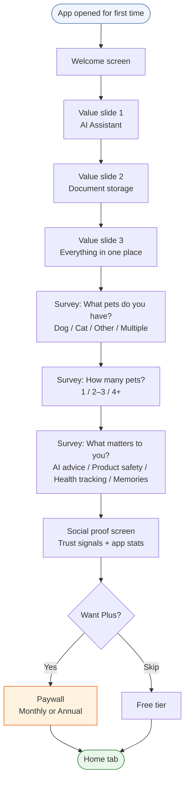
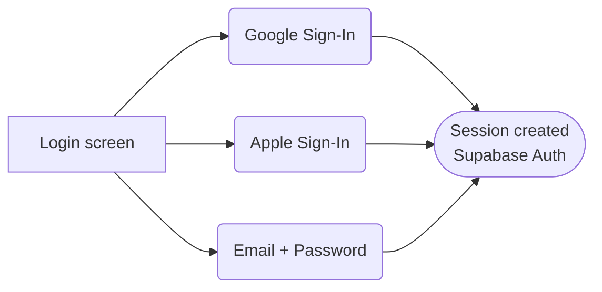

# Feature: Onboarding & Auth
**Last updated**: 2026-04-12 | **Status**: Built — needs pre-launch copy updates

---

## What This Is (Plain English)

When someone downloads Petio for the first time, they go through a short welcome flow before they can use the app. It collects basic information about their pets and shows them what Petio can do — then optionally offers a subscription upgrade. The whole thing takes about 2–3 minutes.

---

## User Journey



---

## Auth Options



Users who already have an account skip onboarding and go directly to the home tab.

---

## What Data Is Collected

| Survey Question | Options | How It's Used |
|----------------|---------|---------------|
| Pet types owned | Dog, Cat, Other, Multiple | Pre-fills pet creation wizard |
| Number of pets | 1, 2–3, 4+ | Social proof copy on paywall |
| Features that matter | AI advice, Product safety, Health tracking, Memories | Future: personalizes home tab and AI chat suggestions |

Survey answers are stored in `AsyncStorage` under `@petio_onboarding` and persist even if the user closes the app mid-flow.

---

## Screen Map (Technical)

```
app/
├── (onboarding)/
│   ├── welcome
│   ├── value-slide-1
│   ├── value-slide-2
│   ├── value-slide-3
│   ├── survey-pet-types
│   ├── survey-pet-count
│   ├── survey-features
│   ├── (paywall)/
│   │   ├── social-proof
│   │   └── confirmation
└── (auth)/
    ├── login
    └── signup
```

---

## State Persistence

Onboarding state is saved at every step so users who close the app can resume exactly where they left off.

```
AsyncStorage key: @petio_onboarding
{
  currentStep: number,
  totalSteps: 11,
  hasCompletedOnboarding: boolean,
  completedAt: ISO string,
  survey: {
    petTypes: string[],
    petCount: string,
    importantFeatures: string[]
  }
}
```

---

## Requirements

### P0 — Must Ship
- [ ] Google + Apple + email auth works on iOS and Android
- [ ] Survey data stored correctly and survives app close/reopen
- [ ] Paywall is shown post-social-proof (skippable — not a hard gate)
- [ ] Completing onboarding routes correctly to home tab

### P1 — Must Fix Before Launch
- [ ] **Update value slide copy** — currently references "Smart Reminders" (removed feature). Must reflect AI-first pivot: AI assistant, product scanner, memories
- [ ] **Update survey feature options** — currently lists "vaccination reminders, vet scheduling, health monitoring, expense tracking". Must update to: AI advice, product safety, health tracking, memories
- [ ] Ensure survey answers feed into AI chat context (e.g., user who selects "product safety" → AI proactively mentions scanner on first chat)

### P2 — Post-Launch
- [ ] A/B test: survey-first vs. value slides-first (which drives higher paywall conversion?)
- [ ] Personalised social proof: show dog stats to dog owners, cat stats to cat owners

---

## Acceptance Criteria

| Scenario | Expected Result |
|----------|----------------|
| New user opens app | Welcome screen appears (not home tab) |
| User closes app on step 5 | Reopens to step 5, not step 1 |
| User skips paywall | Gets free tier, no further interruption |
| Returning user opens app | Goes directly to home tab, skips onboarding |
| User signs in with Google | Session created, routed to onboarding (first time) or home (returning) |

---

## Open Questions

| Question | Owner |
|----------|-------|
| Should onboarding require creating a pet profile before reaching home, or is that optional? | James + Vy |
| Does the social proof screen need real stats or can it use aspirational copy at launch? | Vy |
