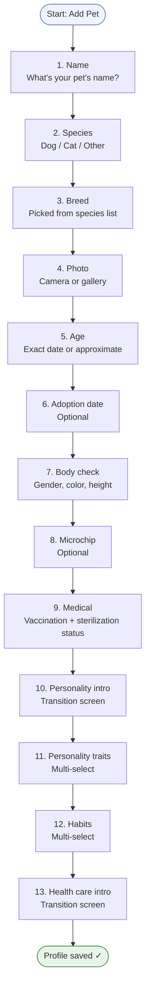
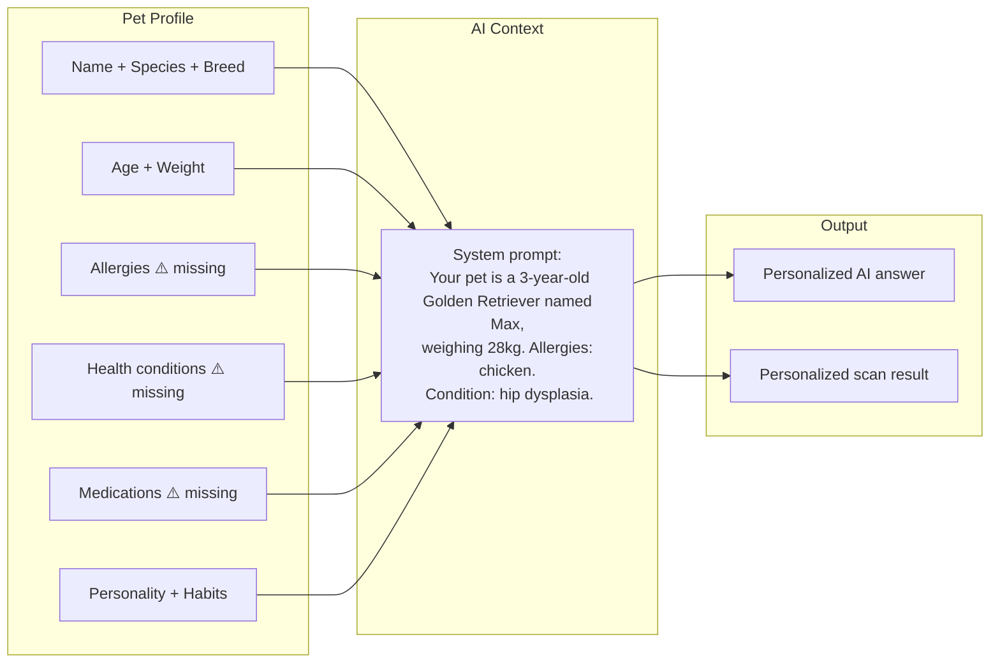
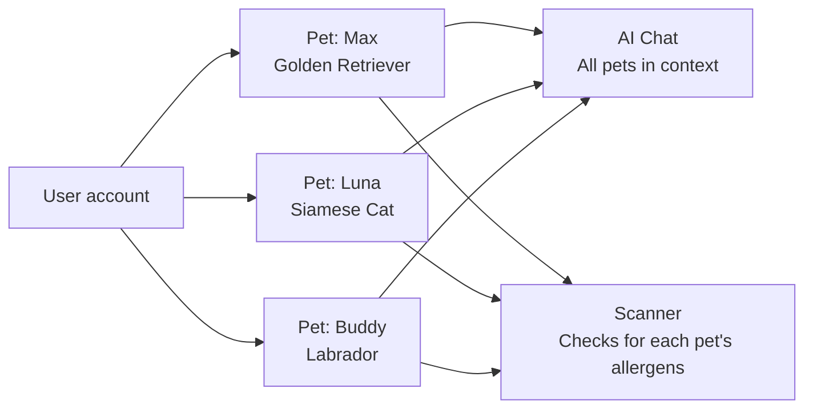

# Feature: Pet Profiles
**Last updated**: 2026-04-12 | **Status**: Built — missing critical allergen fields

---

## What This Is (Plain English)

A pet profile is the foundation of everything in Petio. It's the AI's memory of your pet. The more complete the profile, the more personalized every AI answer and scanner result becomes. Without a profile, the AI gives generic advice — with one, it gives advice specific to your pet's breed, age, health history, and allergies.

Users create a profile through a 13-step wizard the first time they add a pet. They can have multiple pets (free: 1, Plus: unlimited).

---

## Creation Wizard Flow



---

## How Pet Context Powers the AI

Every time a user sends a message in AI chat or scans a product, the pet's profile data is injected into the AI prompt. This is what makes the advice personalized — not generic.



> **Critical gap**: The `allergies[]`, `health_conditions[]`, and `current_medications[]` fields do not yet exist in the schema or wizard. These are the most important fields for scanner accuracy and AI personalization. They must be added before launch.

---

## Data Schema

```
pets table
├── id                      UUID
├── user_id                 UUID (owner)
├── name                    text
├── species_id              UUID → species table
├── breed_id                UUID → breeds table
├── species_display_name    text (denormalized)
├── breed_display_name      text (denormalized)
├── birth_date              date
├── approx_age_category     text (if exact date unknown)
├── adoption_date           date (optional)
├── gender                  text
├── color                   text
├── height                  numeric
├── weight                  numeric
├── microchip_id            text (optional)
├── is_vaccinated           boolean
├── last_vaccination_date   date
├── is_sterilized           boolean
├── sterilized_date         date
├── notes                   text
├── profile_photo_url       text (Supabase Storage)
├── personality_traits      text[]
├── habits                  text[]
└── created_at              timestamp

⚠️ MISSING (must add):
├── allergies               text[]
├── health_conditions       text[]
└── current_medications     text[]
```

---

## Multi-Pet Support



Free tier: 1 pet max. Plus: unlimited. When a free user tries to add a second pet, they see the Plus paywall.

---

## Requirements

### P0 — Must Ship
- [ ] Full 13-step wizard works end-to-end on iOS and Android
- [ ] Pet profile data injected into every AI chat message
- [ ] Free tier enforced: 1 pet max, with Plus upsell on attempt to add second
- [ ] Profile photo uploads and displays correctly

### P1 — Must Add Before Launch ⚠️
- [ ] **Add `allergies[]` field** — step after Medical (step 9). Multi-select from common allergens (chicken, beef, fish, dairy, grain, eggs, soy) + free-text "other"
- [ ] **Add `health_conditions[]` field** — optional, multi-select: diabetes, kidney disease, heart disease, arthritis, obesity, anxiety, other
- [ ] **Add `current_medications[]` field** — optional, free-text list
- [ ] Update AI system prompt to explicitly include allergies and health conditions
- [ ] Profile completeness nudge: "Add your pet's allergies to improve scanner accuracy" (shown on profile screen if allergies empty)

### P2 — Post-Launch
- [ ] `current_food_brand` field → enables "compare this food to what you're already feeding"
- [ ] Pet profile export as shareable card (for vet visits)
- [ ] Weight as required field during wizard (currently optional)

---

## Acceptance Criteria

| Scenario | Expected Result |
|----------|----------------|
| User completes all 13 steps | Pet profile saved, user sees profile screen |
| User with 2 pets sends AI chat | AI references both pets in context |
| Free user tries to add 2nd pet | Plus paywall shown |
| User adds chicken allergy to profile | Scanner flags products containing chicken for that pet |
| User skips optional fields (microchip, adoption date) | Wizard still completes successfully |

---

## Open Questions

| Question | Owner |
|----------|-------|
| Should allergen field be a curated list, free text, or both? | James + Ngoc (design) |
| Should the wizard force allergen entry or keep it optional? | James + Vy |
| What are the most common allergens to include in the curated list? | Vy (research) |
