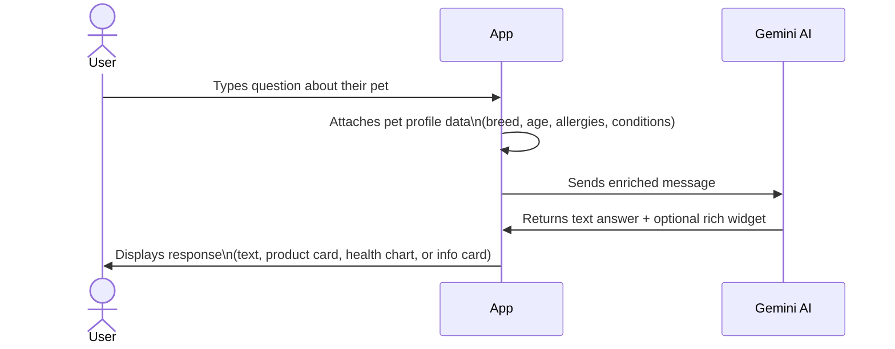
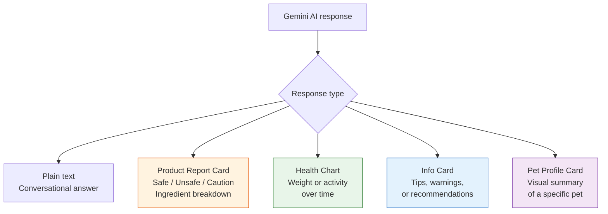
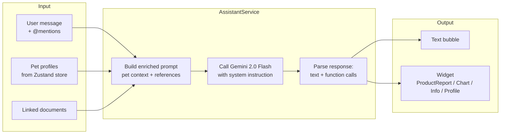

# Feature: AI Chat
**Last updated**: 2026-04-12 | **Status**: Built — allergen context gap, rate limit UI needed

---

## What This Is (Plain English)

AI Chat is the core of Petio's post-pivot identity. It's a conversational AI assistant that knows your specific pets — their breed, age, weight, health history, allergies, and personality. Unlike ChatGPT or Google, every answer is grounded in your pet's actual profile. Ask "can my dog eat this?", "why is my cat acting weird?", or "is this behavior normal for a Golden Retriever at 3 years old?" — and the AI responds with context, not guesswork.

The chat also renders rich "widget" responses — not just plain text. A product scan triggers a visual safety report. A health question can render a chart of your pet's weight trend. This is what makes it feel like a proper AI tool, not just a chatbot.

---

## How It Works (Non-Technical)



---

## Rich Widget Responses

The AI can respond with 4 types of rich cards in addition to plain text:



**When each widget appears:**
| Widget | Triggered when the AI... |
|--------|--------------------------|
| Product Report Card | Analyzes a scanned or mentioned product |
| Health Chart | Shows weight trends or activity data |
| Info Card | Gives a tip, warning, or step-by-step guidance |
| Pet Profile Card | Summarizes a specific pet's data |

---

## @ Mention System

Users can tag their pets or documents directly in the chat to give the AI more specific context.

```
"Is @Max's weight healthy for his age?"
       ↑
   Attaches Max's full profile + weight history to this message
```

```
"Can you read @VaccinationRecord and tell me when the next shot is due?"
                ↑
   Attaches the document content to the prompt
```

---

## Technical Architecture



**Model**: `gemini-2.0-flash`  
**Message history**: Last 50 messages (older messages purged automatically)  
**State**: Zustand `assistantSlice` + AsyncStorage persistence

---

## Free vs Plus Limits

| Tier | AI Messages Per Day |
|------|-------------------|
| Free | 5 messages |
| Plus | Unlimited |

When the 5th free message is sent, the next attempt shows an inline Plus upsell prompt before sending.

---

## Requirements

### P0 — Must Ship
- [ ] Chat sends/receives messages with Gemini 2.0 Flash
- [ ] All 4 widget types render correctly (product report, health chart, info card, pet profile)
- [ ] @ mention works for pet names and documents
- [ ] 5 messages/day free limit with Plus upsell at limit
- [ ] 50-message history with graceful purging
- [ ] Response latency < 3 seconds on typical WiFi/LTE

### P1 — Must Fix Before Launch
- [ ] **Allergen context in prompt**: once `allergies[]` field exists on pet profiles (see Pet Profiles P1), explicitly include it in every chat prompt. Current prompt passes basic fields only.
- [ ] **Health condition context**: include `health_conditions[]` and `current_medications[]` in prompt once those fields exist
- [ ] **Error states**: Gemini API failure, quota exceeded, network timeout — all show user-friendly messages, never crash or hang
- [ ] **Rate limit UI**: clear messaging when daily limit is hit. Show remaining count ("2 messages left today") proactively

### P2 — Post-Launch
- [ ] "Share this answer" button → shareable AI insight card (see Scanner Share Card spec)
- [ ] Conversation history cloud sync (currently device-only via AsyncStorage)
- [ ] Proactive suggestions: "Based on Luna's breed, here are 3 things to watch for this month"
- [ ] Voice input

---

## Acceptance Criteria

| Scenario | Expected Result |
|----------|----------------|
| User with a Golden Retriever with a chicken allergy asks "can my dog eat this food containing chicken meal?" | AI responds with "unsafe" and specifically names chicken as a flagged allergen for their dog |
| User sends 5th free-tier message | 6th message attempt shows Plus paywall prompt before sending |
| Gemini API returns an error | Toast message appears, input remains usable, no crash |
| User @mentions their pet "Luna" | AI response references Luna's specific breed and age |
| User @mentions a document | AI uses document content in its answer |
| User opens chat with 2 pets on their account | AI acknowledges both pets and can answer about either |

---

## Open Questions

| Question | Owner |
|----------|-------|
| Should message limit reset at midnight local time or midnight UTC? | James (eng) |
| Should conversation history sync across devices (requires cloud storage)? | James — post-launch decision |
| Should the AI proactively suggest a vet visit for certain questions? And if so, how do we word it without it feeling like a liability disclaimer? | Vy + James |
