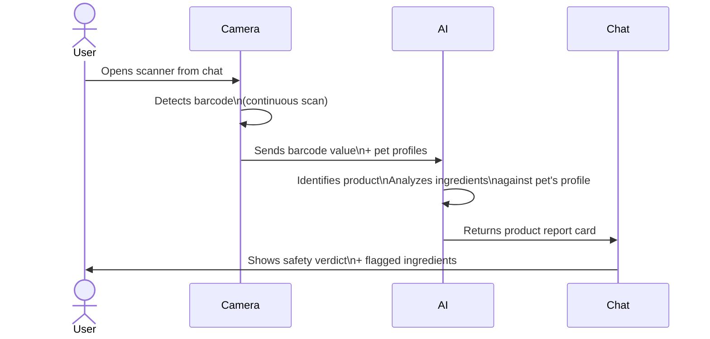
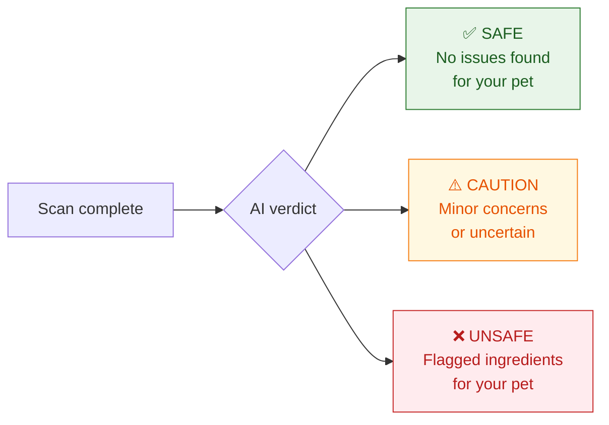
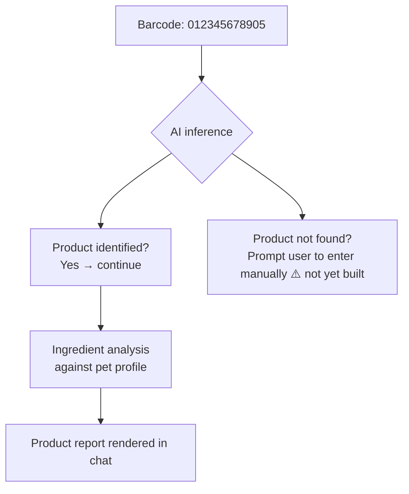

# Feature: Product Scanner
**Last updated**: 2026-04-12 | **Status**: Built — accuracy gap, share mechanic missing, dead buttons

---

## What This Is (Plain English)

The Product Scanner lets users point their phone camera at any pet food or treat barcode and instantly get a safety analysis for their specific pet. It answers the question pet parents ask every time they're in a store or feeding their pet: "Is this actually safe for my dog/cat?"

The answer isn't generic — it's based on the pet's breed, age, known allergies, and health conditions. A food that's fine for most dogs might be dangerous for a dog with kidney disease or a chicken allergy. Petio knows the difference.

This is Petio's most shareable "wow moment" — seeing a flagged ingredient with your pet's name attached to it is alarming in a way that drives people to share and talk about it.

---

## How It Works



---

## Result States



**What the result card shows:**
- Product name
- Safety status badge (Safe / Caution / Unsafe)
- AI explanation (why it's flagged or why it's safe)
- List of flagged or notable ingredients
- Pet name it was checked for (e.g., "For Max · Golden Retriever")

---

## What Powers the Analysis

Currently, the product name and ingredient list are inferred entirely by the AI (Gemini) from the barcode value. There is no local product database.



> **Known accuracy risk**: LLM-only barcode lookup will sometimes misidentify products or have outdated ingredient lists. A third-party product database (e.g., Open Food Facts) is the long-term fix. For launch, we ship with LLM inference and add a "Report incorrect result" button as a mitigation.

---

## Scanner UI

```
┌─────────────────────────────┐
│                             │
│   ┌──────────────────────┐  │
│   │                      │  │
│   │    [SCAN FRAME]      │  │
│   │    240 × 160 dp      │  │
│   │                      │  │
│   └──────────────────────┘  │
│                             │
│  Align the barcode inside   │
│        the frame            │
│                             │
│   [ Use Sample Barcode ]    │
│                             │
└─────────────────────────────┘
```

- Corner indicators (white borders) mark the scan zone
- "Use Sample Barcode" button for testing without a physical product (barcode: `012345678905`)
- First-time tooltip shown once, dismissed permanently

---

## Free vs Plus Limits

| Tier | Scans Per Day |
|------|--------------|
| Free | 3 scans |
| Plus | Unlimited |

---

## Current Dead Buttons (Must Fix Before Launch)

| Button | Current State | Required Fix |
|--------|--------------|--------------|
| "Full Report" | Tappable but no destination | Navigate to full ingredient breakdown view |
| "Find Alternatives" | Tappable but no action | Triggers AI chat follow-up: "Find safer alternatives to [product name]" |
| "Share Scan" | Does not exist yet | See Scanner Share Card spec |

---

## Requirements

### P0 — Must Ship
- [ ] Camera permission handling on iOS + Android (with settings deep link if denied)
- [ ] Barcode detection fires reliably on standard pet food UPC-A and EAN-13 barcodes
- [ ] Product report renders with correct status (safe/caution/unsafe)
- [ ] Analysis text references the user's specific pet (not generic)
- [ ] Free tier: 3 scans/day with Plus upsell at limit

### P1 — Must Fix Before Launch
- [ ] **Allergen-aware analysis**: requires `allergies[]` on pet profile (see Pet Profiles P1). Without this, "unsafe" flags are based on general breed/species safety, not the pet's known allergens
- [ ] **"Product not found" handling**: when Gemini cannot identify the barcode, show a prompt to enter the product name manually instead of returning a blank or wrong result
- [ ] **Wire "Full Report" button**: full ingredient list view within the chat/result screen
- [ ] **Wire "Find Alternatives" button**: sends an AI follow-up message "Find safer alternatives to [product name] for [pet name]"
- [ ] **"Report incorrect result" button**: lets users flag wrong product identification (stores report to Supabase for review)
- [ ] **Scan history**: store last 10 scanned products per pet (table: `scan_history`, fields: barcode, product_name, status, scanned_at, pet_id)

### P2 — Post-Launch
- [ ] Third-party barcode product database integration (Open Food Facts or similar) to improve accuracy
- [ ] Ingredient watchlist: tap a flagged ingredient → add to pet's permanent allergen watchlist
- [ ] Batch compare: scan 2 products side by side → AI picks the safer one
- [ ] Scanner share card (see dedicated spec)

---

## Acceptance Criteria

| Scenario | Expected Result |
|----------|----------------|
| User scans a valid barcode | Result card appears within 3 seconds |
| Pet has chicken allergy; product contains chicken meal | Status is "unsafe", chicken listed as flagged ingredient for that pet |
| Barcode not recognized by AI | "Product not found" prompt appears, user can type name manually |
| Free user attempts 4th scan | Camera opens but scan is blocked; Plus upsell shown |
| User taps "Find Alternatives" | AI chat sends follow-up message asking for safer alternatives |
| User taps "Full Report" | Full ingredient list view opens |

---

## Open Questions

| Question | Owner |
|----------|-------|
| Should we integrate a barcode product database at launch or post-launch? | James (eng) — post-launch decision |
| If a user has multiple pets, which pet's profile does the scanner check against? All of them, or the last selected? | James + Ngoc (design/UX) |
| What's the right UI for "this product is safe for Max but unsafe for Luna"? | Ngoc (design) |
