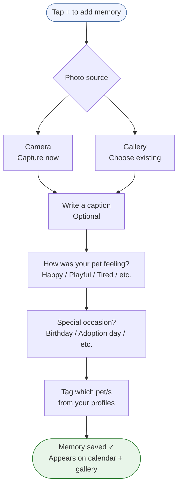
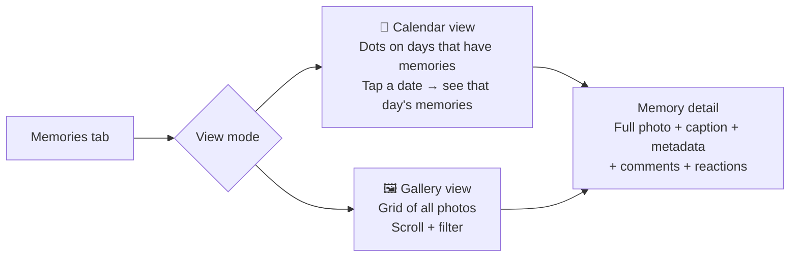
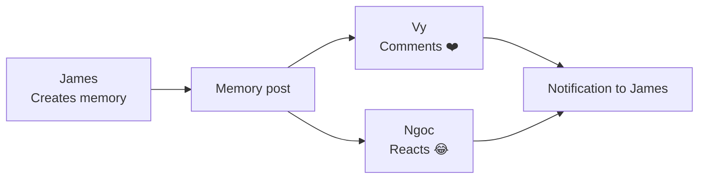

# Feature: Memories
**Last updated**: 2026-04-12 | **Status**: Built — primary retention feature

---

## What This Is (Plain English)

Memories is a photo journal for your pets. Users capture special moments — a birthday, a funny pose, a first time at the beach — with a photo, a caption, and optional context (how the pet was feeling, the weather, a special occasion). They can browse by date in a calendar or scroll through a gallery. Family members who share the same pet can comment and react.

This is the feature that keeps users coming back every day. It's not about health or AI — it's about emotional connection. People love their pets, and Memories gives that love a place to live.

---

## Creating a Memory



---

## Viewing Memories



---

## Social Layer (Family Sharing)

Memories can be shared with family members who are co-managing the same pet. They can comment and react — making it a lightweight family pet scrapbook.



**Social features available:**
- Comments (threaded — replies supported)
- Reactions (emoji-based with counts)
- @mentions in comments (notifies the mentioned user)
- External share: share the photo + caption to any app via the native share sheet (`expo-sharing`)

---

## Data Structure

```
memories table
├── id                  UUID
├── user_id             UUID (creator)
├── photo_url           text (Supabase Storage, signed URL 365-day expiry)
├── caption             text
├── feeling             text  (happy, playful, tired, anxious, etc.)
├── weather             text
├── special_date_type   text  (birthday, adoption_day, vet_visit, etc.)
├── special_date_note   text
├── memory_date         date
└── created_at          timestamp

memory_pets (junction table — one memory can tag multiple pets)
├── memory_id → memories.id
└── pet_id    → pets.id

comments table
├── id, target_type ("memory"), target_id (memory_id)
├── content, user_id
├── parent_comment_id   (for threaded replies)
└── created_at

reactions table
├── id, target_type, target_id
├── emoji, user_id
└── created_at
```

---

## Free vs Plus Limits

| Tier | Memories Per Day |
|------|----------------|
| Free | 3 memories/day |
| Plus | Unlimited |

---

## Requirements

### P0 — Must Ship
- [ ] Photo capture (camera) and gallery upload work on iOS and Android
- [ ] Calendar view shows dots on days with memories; tap → see memories for that day
- [ ] Gallery/grid view works with scroll
- [ ] Memory detail shows photo, caption, metadata, comments, reactions
- [ ] Free 3/day limit enforced with Plus upsell
- [ ] External share (expo-sharing) works

### P1 — Pre-Launch
- [ ] Memory creation is ≤ 3 taps from home screen (discoverability)
- [ ] Push notification to memory creator when a family member comments or reacts
- [ ] Empty state for new users: compelling CTA to capture first moment (not just a blank screen)

### P2 — Post-Launch
- [ ] "This day last year" notification (high-engagement, strong retention loop)
- [ ] Annual highlights reel / year-in-review
- [ ] Shareable memory card with Petio watermark (for external social media)
- [ ] Memory slideshow / video export

---

## Acceptance Criteria

| Scenario | Expected Result |
|----------|----------------|
| User creates a memory with a photo | Photo saved, appears as a dot on the calendar on the correct date |
| User taps a date with a memory | Thumbnail grid shows all memories from that date |
| Free user creates 3 memories in one day | 4th attempt shows Plus paywall |
| Family member comments on a memory | Memory owner receives a push notification |
| User taps "Share" on a memory | Native share sheet opens with the photo and caption |

---

## Open Questions

| Question | Owner |
|----------|-------|
| Should memories be visible only to family members who share that pet, or all family members? | James + Vy |
| Should we show memories in the AI chat (e.g., "Here's a memory from last month when you asked about this")? | James — post-launch |
