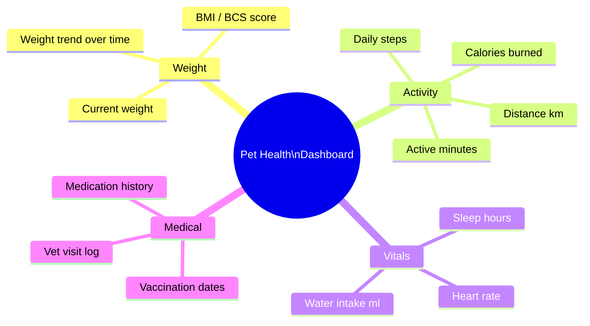
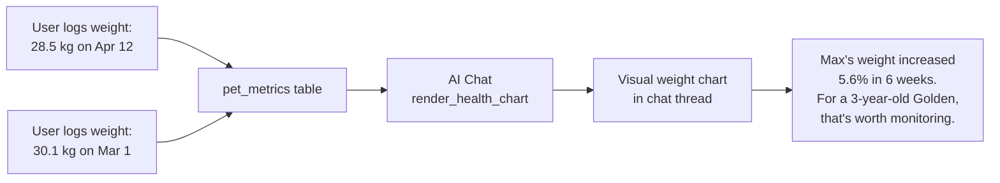

# Feature: Health & Statistics
**Last updated**: 2026-04-12 | **Status**: Structure built — currently showing mock data, needs real entry flow

---

## What This Is (Plain English)

Health & Statistics is the data layer of Petio — a dashboard that tracks your pet's weight, activity, and wellness metrics over time. It turns raw numbers into visual trends, so you can see at a glance whether your dog's weight is trending up, whether they've been active this week, or how their health has changed since you adopted them.

This feature deepens engagement for the "proactive/health-oriented" user segment — people who already track their pet's health closely and want a smart tool that understands what those numbers mean for their specific breed and age.

The AI chat can pull this data and surface it as a health chart widget in conversation — making it the bridge between raw tracking and AI-powered interpretation.

---

## What Gets Tracked



---

## How Data Flows Into the AI



---

## Dashboard Layout

```
┌──────────────────────────────────┐
│  Health Stats            [Max ▼] │  ← Pet selector dropdown
├──────────────────────────────────┤
│                                  │
│   ┌──────────┐  ┌──────────┐    │
│   │ Weight   │  │ Activity │    │
│   │ 28.5 kg  │  │ 3,200    │    │
│   │ ↑ +2%    │  │ steps    │    │
│   └──────────┘  └──────────┘    │
│                                  │
│   ┌──────────┐  ┌──────────┐    │
│   │ Sleep    │  │ Water    │    │
│   │ 11.5 hrs │  │ 420 ml   │    │
│   └──────────┘  └──────────┘    │
│                                  │
│   ┌──────────────────────────┐  │
│   │  Weight trend (6 months) │  │
│   │  [line chart]            │  │
│   └──────────────────────────┘  │
└──────────────────────────────────┘
```

---

## Data Schema

```
pet_metrics table
├── id              UUID
├── pet_id          UUID → pets.id
├── metric_type     text  (weight | steps | distance | calories |
│                         active_minutes | heart_rate | sleep_hours |
│                         water_intake)
├── metric_value    numeric
├── metric_date     date
├── recorded_by     UUID → users.id
├── notes           text (optional)
└── created_at      timestamp
```

---

## Current State vs. What's Needed

| Metric | Currently Shows | What's Needed |
|--------|----------------|---------------|
| Weight | Mock data | Real entry form + chart with real data |
| Activity (steps, distance, calories) | Mock data | Manual entry form OR Health app integration |
| Heart rate, sleep, water intake | Mock data | Manual entry form (or remove from dashboard until data exists) |
| Vet visits | Not tracked | Simple log: date, clinic, reason, notes |
| Vaccination dates | On pet profile | Surface here as upcoming reminders |

> **Pre-launch minimum**: Weight tracking must work with real data. All other metrics can show "coming soon" or be hidden until real entry is possible. Don't show mock data to real users.

---

## Requirements

### P0 — Must Ship
- [ ] Weight entry form: input value + date + optional note → saved to `pet_metrics`
- [ ] Weight trend chart renders with real user data (not mock)
- [ ] AI chat `render_health_chart` function pulls real `pet_metrics` data
- [ ] Pet selector dropdown filters stats by pet

### P1 — Pre-Launch
- [ ] Manual entry for all tracked metrics (simple form per metric type)
- [ ] Hide or replace mock data for metrics with no real entry yet (no fake numbers for real users)
- [ ] Vet visit log: date, clinic name, reason, notes — tied to pet profile

### P2 — Post-Launch
- [ ] Apple Health / Google Fit integration for automatic activity sync
- [ ] AI proactive health insight: "Luna's weight has increased 8% in 3 months — here's what that means for a 3-year-old Beagle"
- [ ] Vaccination due-date reminders (based on `last_vaccination_date` on pet profile)
- [ ] Abnormal metric detection: flag if weight change > threshold for breed/age

---

## Acceptance Criteria

| Scenario | Expected Result |
|----------|----------------|
| User logs weight of 28.5 kg for Max | Entry saved, chart updates to include new data point |
| User asks AI "show me Max's weight trend" | AI renders a health chart widget with real weight history |
| User with no logged metrics opens stats | Empty state with CTA to log first entry (not mock data) |
| User has 2 pets | Pet selector dropdown switches chart between pets |

---

## Open Questions

| Question | Owner |
|----------|-------|
| Should we hide activity/sleep/water metrics at launch since we have no real data entry for them? Or show with "Log your first entry" empty state? | James + Ngoc |
| Should weight entry be in kg only, or support lb with unit toggle? | James (may depend on US vs VN user location) |
