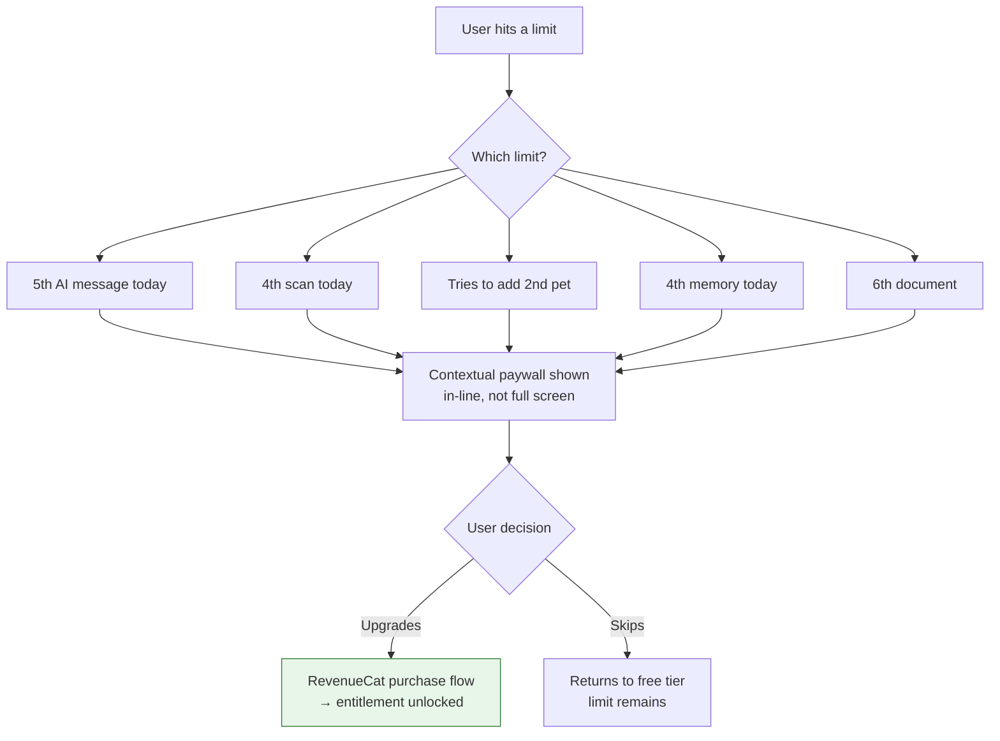
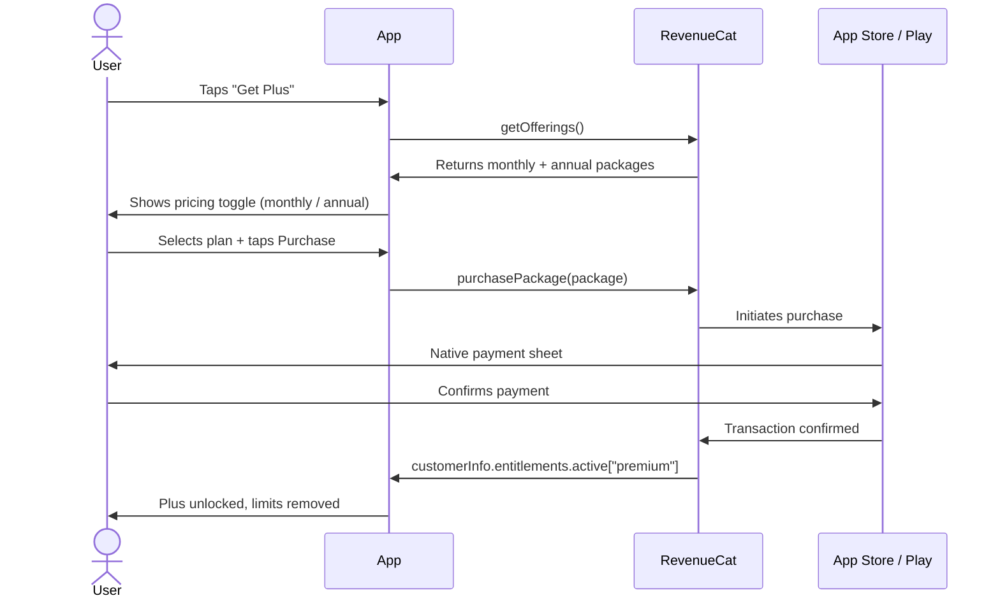

# Feature: Paywall & Subscriptions
**Last updated**: 2026-04-12 | **Status**: Built — pricing in RevenueCat needs updating before launch

---

## What This Is (Plain English)

Petio uses a freemium model — anyone can download and use the app for free, with generous limits. Users who want unlimited access upgrade to Petio Plus. The upgrade is handled through the App Store (iOS) and Google Play (Android) via RevenueCat, which manages billing, receipts, and subscription state.

The paywall is shown in two places: during onboarding (as an optional upsell after the social proof screen) and contextually when a user hits a free-tier limit (e.g., tries to scan a 4th product or add a second pet).

---

## Free vs Plus

```mermaid
flowchart LR
    subgraph Free Tier
        A1[5 AI messages / day]
        A2[3 product scans / day]
        A3[1 pet profile]
        A4[3 memories / day]
        A5[5 documents]
        A6[1 family]
    end

    subgraph Plus ✨
        B1[Unlimited AI messages]
        B2[Unlimited scans]
        B3[Unlimited pets]
        B4[Unlimited memories]
        B5[Unlimited documents]
        B6[Unlimited families]
        B7[Allergen watchlist]
        B8[Advanced health insights]
    end
```

---

## Pricing

| Plan | US / Global | Vietnam |
|------|------------|---------|
| Monthly | $5.99 / month | 79,000 VND / month |
| Annual | $47.99 / year (~$4.00/mo) | 599,000 VND / year |

> ⚠️ **Action required**: RevenueCat currently has $3.99/mo and $34.99/yr configured. Must update to the above pricing before launch. Also need to set up the Vietnam pricing tier (79K / 599K VND) separately.

---

## Paywall Trigger Points



Also shown during onboarding after the social proof screen — optional skip, not required to continue.

---

## Technical Flow (Subscription Purchase)



---

## Entitlement Check Pattern

Throughout the app, Plus features are gated using:

```
const isPremium = customerInfo.entitlements.active["premium"]?.isActive
```

This is checked at:
- Feature limit enforcement (scanner, chat, memories, pets, docs)
- Settings screen (shows current plan status)
- Paywall screen (shows correct CTA: "Upgrade" vs "Manage")

---

## Requirements

### P0 — Must Ship
- [ ] Purchase flow works on iOS (StoreKit) and Android (Google Play Billing)
- [ ] Entitlement check works — Plus users never see limit prompts
- [ ] Restore purchases works for existing subscribers
- [ ] All 6 free-tier limits enforced correctly with Plus upsell shown in-context
- [ ] Annual/monthly toggle works on paywall screen

### P1 — Must Fix Before Launch ⚠️
- [ ] **Update RevenueCat pricing**: $5.99/mo and $47.99/yr (US), 79K VND/mo and 599K VND/yr (Vietnam)
- [ ] **Set up Vietnam pricing tier** in RevenueCat with local currency
- [ ] **Vietnamese App Store listing** must show VND pricing, not USD
- [ ] Contextual paywall copy: when shown at a limit, explain which limit was hit ("You've used your 3 free scans today. Upgrade to scan unlimited products.")
- [ ] Subscription management link in Settings (lets users cancel or manage from within app)
- [ ] **Annual plan as default** — annual must be the top/highlighted option at paywall. Monthly is secondary. Add "Save 33%" badge. Rationale: 50 annual subscribers = $2,400 upfront cash vs $300/mo from 50 monthly — annual is the path to $1K MRR faster.

### P2 — Post-Launch
- [ ] Referral program: "Give 1 month Plus, Get 1 month Plus" via RevenueCat promo codes
- [ ] Trial period: 7-day free trial of Plus for new users (A/B test vs. no trial)
- [ ] Annual upsell: if user is on monthly, show "Switch to annual — save X%" prompt after 2 months

---

## Acceptance Criteria

| Scenario | Expected Result |
|----------|----------------|
| Free user scans 4th product today | Camera opens, scan blocked, Plus paywall shown with "unlimited scans" CTA |
| User taps "Get Plus" → completes purchase | Plus unlocked immediately, no app restart needed |
| User restores purchase on new device | Previous Plus subscription recognized, limits removed |
| Plus user opens any gated screen | No limit prompt, no paywall — seamless experience |
| Vietnam user opens paywall | Sees 79,000 VND / 599,000 VND pricing in VND, not USD |

---

## Open Questions

| Question | Owner |
|----------|-------|
| Should we offer a 7-day free trial at launch or go straight to paid? | James + Vy |
| What's the paywall conversion benchmark we're targeting? (industry standard is 3–8%) | Vy |
| Should the contextual paywall be a bottom sheet or full screen? | Ngoc (design) |
