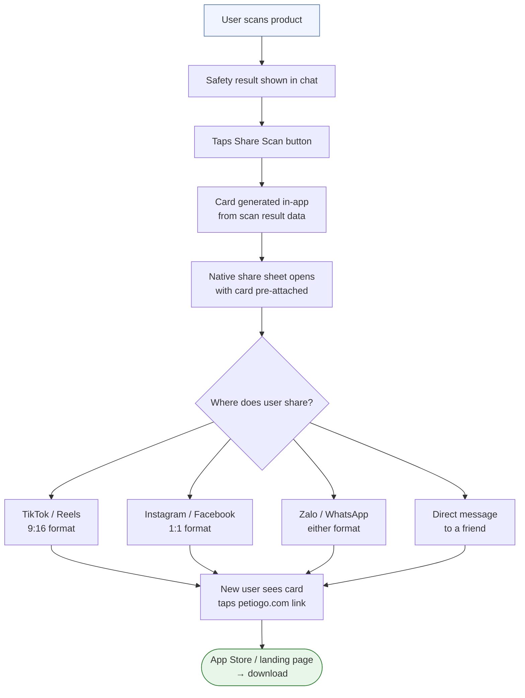
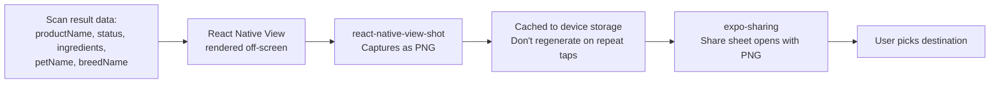

# Feature: Scanner Share Card (Planned)
**Last updated**: 2026-04-12 | **Status**: Not yet built — target: before June 14 launch

---

## What This Is (Plain English)

After a user scans a product and gets a safety result, they should be able to share it instantly — as a beautiful, informative image card — to TikTok, Facebook pet groups, Instagram, Zalo, or anywhere else. The card shows the product name, the safety verdict for their specific pet, and the flagged ingredients, with a "Checked by Petio" badge.

This is Petio's primary acquisition loop. When someone in a 200K-member Vietnamese pet Facebook group posts "I checked [popular brand] for my dog and found 3 flagged ingredients" — with Petio's card attached — that post drives installs. This is how we grow without paid ads.

*See [Growth Loops Analysis](../marketing/growth-loops_petio_2026-04-12.md) for full strategic context.*

---

## User Flow



---

## Card Design Spec (For Ngoc)

Two formats required: **9:16** (TikTok/Stories) and **1:1** (Feed/Facebook).

### Content Hierarchy

```
┌─────────────────────────────────┐
│                                 │
│   [PRODUCT PHOTO]               │
│   Product Name                  │  ← Large, clear
│                                 │
│  ┌───────────────────────────┐  │
│  │  ⚠️  3 FLAGGED INGREDIENTS │  │  ← Big verdict badge
│  │  For Max · Golden Retriever│  │  ← Pet-specific line
│  └───────────────────────────┘  │
│                                 │
│  Flagged ingredients:           │
│  • Chicken meal                 │  ← Concrete, named
│  • Corn syrup                   │
│  • Artificial coloring          │
│                                 │
│              Checked by Petio   │
│              petiogo.com  🐾    │  ← Bottom right, subtle
└─────────────────────────────────┘
```

### Safe Result Version

```
┌─────────────────────────────────┐
│                                 │
│   [PRODUCT PHOTO]               │
│   Product Name                  │
│                                 │
│  ┌───────────────────────────┐  │
│  │  ✅  SAFE FOR YOUR PET    │  │
│  │  For Max · Golden Retriever│  │
│  └───────────────────────────┘  │
│                                 │
│  All ingredients checked —      │
│  no issues found for Max.       │
│                                 │
│              Checked by Petio   │
│              petiogo.com  🐾    │
└─────────────────────────────────┘
```

### Design Rules
- **Verdict badge**: Must be the dominant visual element — large, high-contrast color (red for unsafe, amber for caution, green for safe)
- **Pet name line**: Always show "For [name] · [breed]" — this is what proves AI personalization vs. generic results
- **Badge/watermark**: "Checked by Petio · petiogo.com" — bottom right, subtle. Not a call-to-action. The link does the work.
- **No price/subscription copy** on the card itself — this kills organic shareability
- **Photography**: Use product photo if available; fallback to product name on a clean background
- **Font**: Match Petio design system tokens

---

## UTM Attribution

Every card shared must include a trackable link so we can measure which channels drive installs.

```
https://petiogo.com?utm_source=scan_share&utm_medium=tiktok
https://petiogo.com?utm_source=scan_share&utm_medium=facebook
https://petiogo.com?utm_source=scan_share&utm_medium=instagram
https://petiogo.com?utm_source=scan_share&utm_medium=other
```

The share sheet should pre-suggest the likely platform based on where the user shares. If not determinable, use `utm_medium=other`.

---

## Technical Approach



**Library**: `react-native-view-shot` (captures a React Native View as an image)  
**Format**: PNG, 1080×1920 (9:16) or 1080×1080 (1:1) — user picks or auto-selects based on platform  
**Cache**: Generated image stored in device temp storage, regenerated only if scan data changes

---

## Requirements

### P0 — Must Ship
- [ ] "Share Scan" button appears on product report card after scan completes
- [ ] Card generated in-app from scan result data (product name, status, ingredients, pet name, breed)
- [ ] Share sheet opens with card pre-attached (expo-sharing)
- [ ] Both 9:16 and 1:1 formats generated
- [ ] UTM link embedded in caption text of share (not on the card image itself)

### P1 — Pre-Launch
- [ ] Card caches on device (no regeneration on repeat taps)
- [ ] Graceful fallback if product photo not available (use product name on branded background)
- [ ] Analytics event fires: `scan_card_shared` with platform, status (safe/unsafe/caution), pet_id

### P2 — Post-Launch
- [ ] A/B test: alarming headline ("⚠ FLAGGED INGREDIENTS") vs. informational ("Safety check complete")
- [ ] AI Chat answer share card (same mechanic applied to chat responses)

---

## Acceptance Criteria

| Scenario | Expected Result |
|----------|----------------|
| User scans a product (unsafe result) | "Share Scan" button appears below the result card |
| User taps Share Scan | Native share sheet opens with the card image pre-attached and a caption including the UTM link |
| User shares to TikTok | Card is 9:16 ratio, no black bars |
| User taps Share Scan a second time | Same card served from cache instantly (no regeneration) |
| Product photo not available | Card shows product name in large text on a Petio-branded background |
| New user sees shared card and taps link | Landing at petiogo.com with `utm_source=scan_share` captured in analytics |

---

## Open Questions

| Question | Owner |
|----------|-------|
| Should we show a format picker (9:16 vs 1:1) or auto-select based on where they share? | Ngoc (design UX) |
| Should the "Share Scan" button appear for SAFE results too, or only unsafe/caution? | James + Vy — safe shares are less viral but still build awareness |
| Should the card include the full ingredient list or just flagged ingredients? | Ngoc (design) |
