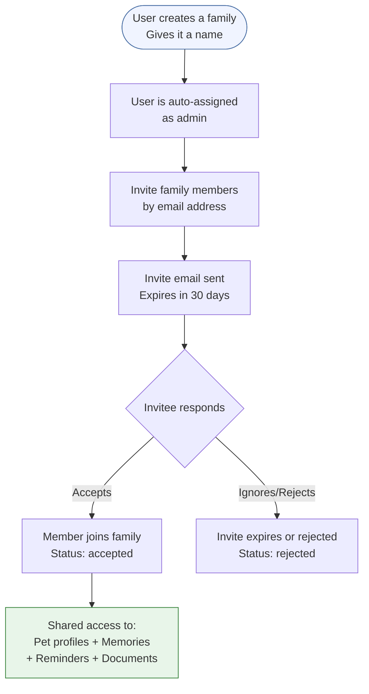
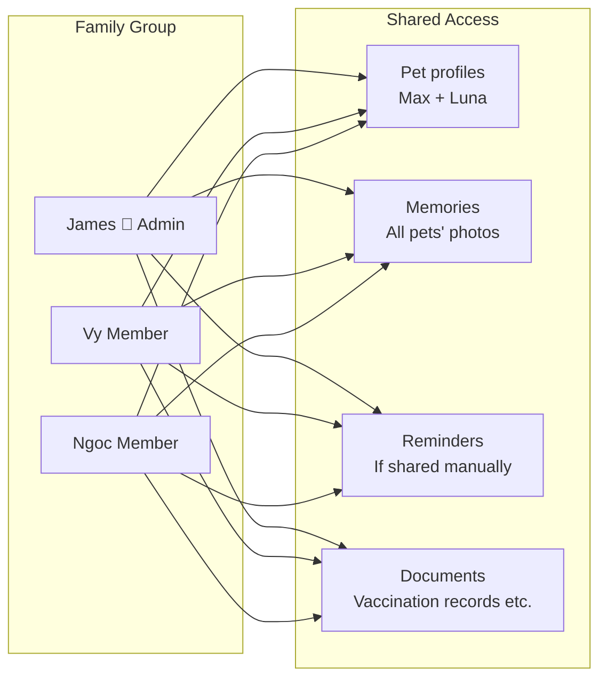
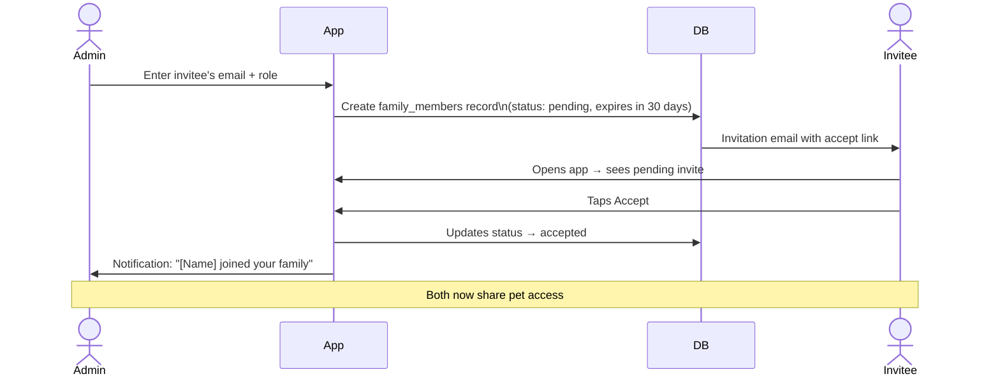
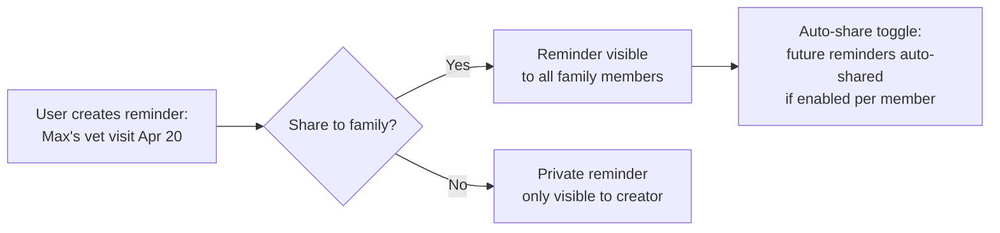

# Feature: Family Sync
**Last updated**: 2026-04-12 | **Status**: Built

---

## What This Is (Plain English)

Family Sync lets multiple people manage the same pet together. You invite a partner, family member, or roommate — they join your family group, and now you both have access to the same pet profiles, memories, and shared reminders. If you scan a product and find an unsafe ingredient, your partner sees it too. If your partner logs a vet visit, you see it. Everyone stays on the same page.

This is especially useful for:
- Couples or households sharing pet care duties
- Multi-generational families (common in Vietnam — grandparents, parents, and kids all involved with a pet)
- Pet owners who travel and leave their pet with family

---

## How It Works



---

## What Gets Shared



---

## Invitation Flow



---

## Reminder Sharing

Reminders are not automatically shared — the owner decides which reminders to share to the family.



---

## Data Schema

```
families
├── id          UUID
├── name        text
├── created_by  UUID → users.id
└── created_at  timestamp

family_members
├── id              UUID
├── family_id       UUID → families.id
├── user_id         UUID → users.id
├── role            text  (admin | member)
├── status          text  (pending | accepted | rejected)
├── auto_share_reminders  boolean
├── invited_at      timestamp
└── expires_at      timestamp  (30 days after invite)

family_pets  (junction — links pets to a family)
├── family_id   UUID → families.id
└── pet_id      UUID → pets.id

reminder_family_shares  (which reminders are shared to which family)
├── reminder_id UUID → reminders.id
└── family_id   UUID → families.id
```

**Current family stored locally**: `AsyncStorage` key `@petio/current_family_id`

---

## Free vs Plus Limits

| Tier | Families |
|------|---------|
| Free | 1 family |
| Plus | Unlimited |

---

## Requirements

### P0 — Must Ship
- [ ] Create family (name, admin role auto-assigned)
- [ ] Invite by email — creates pending record with 30-day expiry
- [ ] Accept/reject invitation flow in-app
- [ ] Shared pet profiles visible to all accepted family members
- [ ] Shared memories visible to all family members (comments/reactions work cross-member)
- [ ] Free tier: 1 family max, Plus upsell on second family attempt

### P1 — Pre-Launch
- [ ] Push notification when invitation is accepted: "[Name] joined your family"
- [ ] Push notification when invited (deep link into the accept flow)
- [ ] Family member list screen: shows all members, their role, and invite status
- [ ] Remove/leave family: admin can remove members; any member can leave

### P2 — Post-Launch
- [ ] Role-based permissions: admin can restrict which pets a specific member can view
- [ ] Family activity feed: see recent actions by family members (logged a memory, scanned a product, etc.)

---

## Acceptance Criteria

| Scenario | Expected Result |
|----------|----------------|
| User creates a family and invites a member | Invitation created, invitee receives notification/email |
| Invitee accepts invitation | Both users see shared pet profiles and memories |
| Invite is not accepted within 30 days | Invite expires, shows as expired in admin's family screen |
| Member comments on a shared memory | Memory owner receives a push notification |
| Free user tries to create a 2nd family | Plus paywall shown |
| Admin removes a member | Member loses access to shared pets and memories immediately |

---

## Open Questions

| Question | Owner |
|----------|-------|
| Should pet sharing be opt-in per pet (admin selects which pets are shared) or automatic for all pets? | James + Vy |
| Should removed members retain access to memories they created within the family? | James |
