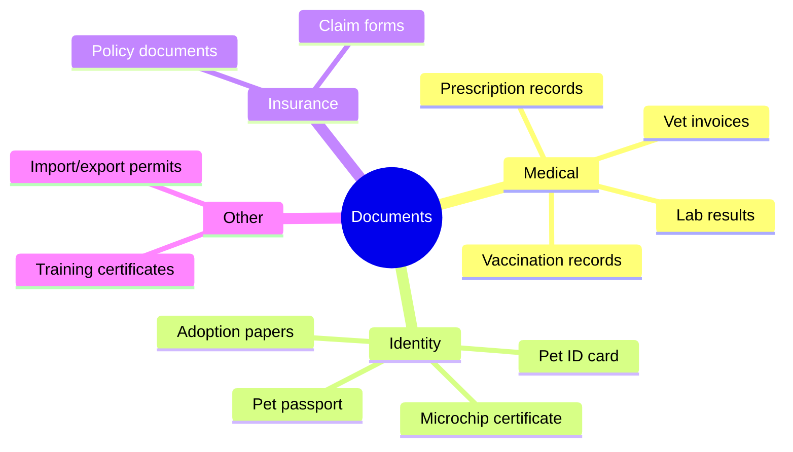
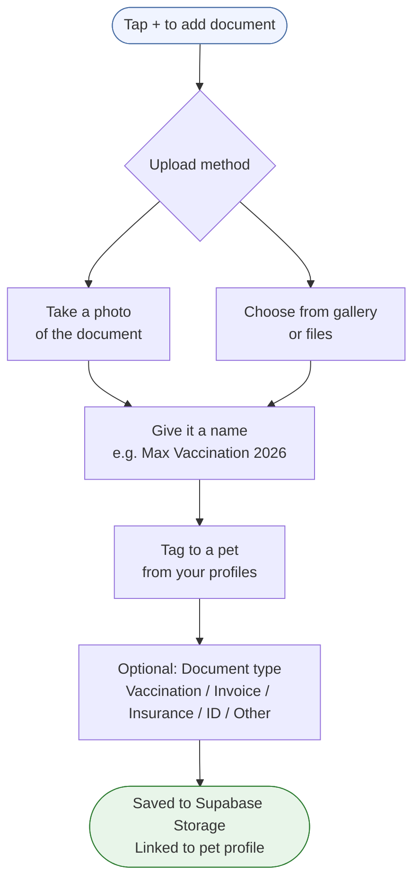
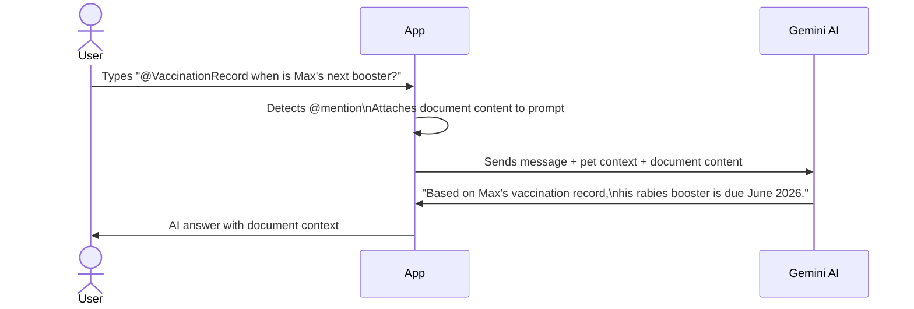
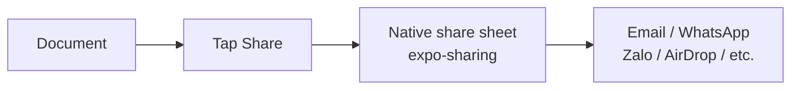

# Feature: Documents
**Last updated**: 2026-04-12 | **Status**: Built

---

## What This Is (Plain English)

Documents is a secure storage space for all your pet's important paperwork — vaccination records, vet invoices, insurance certificates, microchip IDs, adoption papers. Instead of digging through emails or a drawer when the vet asks "when was the last rabies shot?", it's all in one place tagged to the right pet.

Documents also plug into the AI chat via @ mention — users can reference a document in chat and the AI will read and interpret it ("@VaccinationRecord — when is Max's next booster due?").

---

## What Can Be Stored



---

## How It Works



---

## AI Chat Integration

Documents are first-class citizens in the AI chat — users can @ mention them to bring them into the conversation.



This transforms documents from passive storage into active, queryable context for the AI.

---

## Sharing

Documents can be shared externally via the native share sheet — useful for:
- Sending a vaccination record to a kennel or groomer
- Sharing vet invoices with insurance
- Sharing a document with a family member who isn't on Petio



---

## Data Schema

```
documents table
├── id              UUID
├── user_id         UUID → users.id
├── name            text  (user-given label)
├── file_url        text  (Supabase Storage, signed URL)
├── file_type       text  (image/jpeg, application/pdf, etc.)
├── document_type   text  (vaccination | invoice | insurance | id | other)
│                         ⚠️ type field is P1 — not yet in schema
├── notes           text  (optional)
└── created_at      timestamp

document_pets  (junction — links documents to one or more pets)
├── document_id UUID → documents.id
└── pet_id      UUID → pets.id
```

**Comments + reactions** are supported via the same system as memories (targetType: "document").

---

## Free vs Plus Limits

| Tier | Documents |
|------|----------|
| Free | 5 documents |
| Plus | Unlimited |

---

## Requirements

### P0 — Must Ship
- [ ] Upload document via camera or gallery/files on iOS and Android
- [ ] Name and tag to a pet profile
- [ ] View document list filtered by pet
- [ ] External share via native share sheet (expo-sharing)
- [ ] AI chat @mention attaches document content to prompt
- [ ] Free tier: 5 documents max with Plus upsell

### P1 — Pre-Launch
- [ ] **Document type tagging** (vaccination, invoice, insurance, ID, other) — makes the list scannable and enables future filtering
- [ ] **Vet invoice AI parsing**: when a vet invoice photo is uploaded, AI extracts date, clinic name, amount, and diagnosis automatically — saves the user from manual entry
- [ ] Document list view: sortable by date, filterable by pet and document type

### P2 — Post-Launch
- [ ] PDF support (not just images)
- [ ] AI proactive: "Max's vaccination record shows his last rabies shot was 11 months ago — boosters are typically annual for his breed"
- [ ] Expiry reminders: flag documents with upcoming expiry dates (insurance, permits)
- [ ] Family sharing: allow specific documents to be shared with family members

---

## Acceptance Criteria

| Scenario | Expected Result |
|----------|----------------|
| User uploads a vaccination certificate photo | Document saved, visible in documents list tagged to correct pet |
| User @mentions a document in AI chat | AI reads and references the document content in its response |
| User taps Share on a document | Native share sheet opens with the document attached |
| Free user tries to add a 6th document | Plus paywall shown |
| User views documents filtered by "Max" | Only documents tagged to Max are shown |

---

## Open Questions

| Question | Owner |
|----------|-------|
| Should documents be visible to all family members by default, or must they be explicitly shared? | James + Vy |
| Should the AI invoice parser be automatic on upload or triggered manually ("Extract info from this invoice")? | James |
