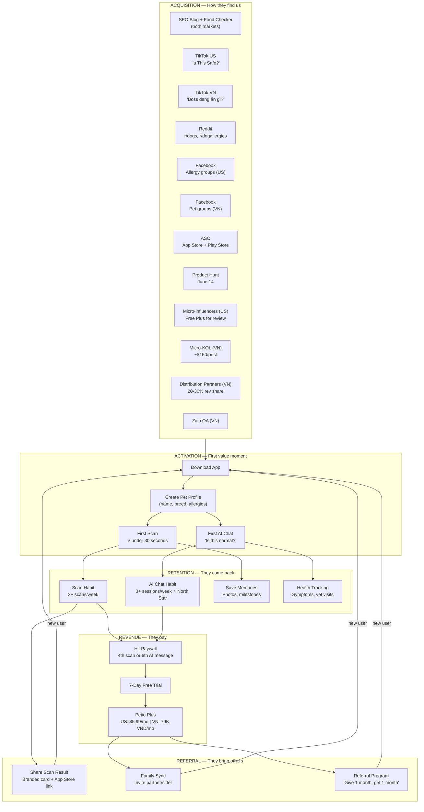
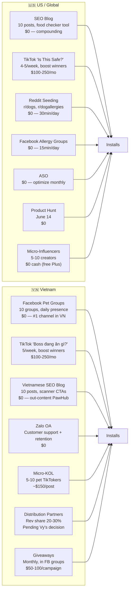
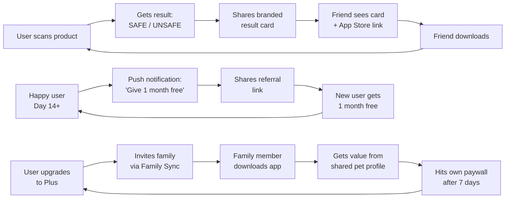
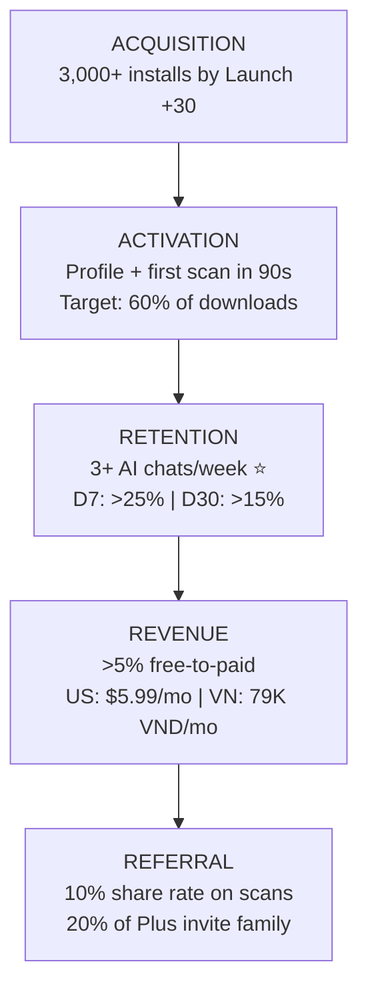
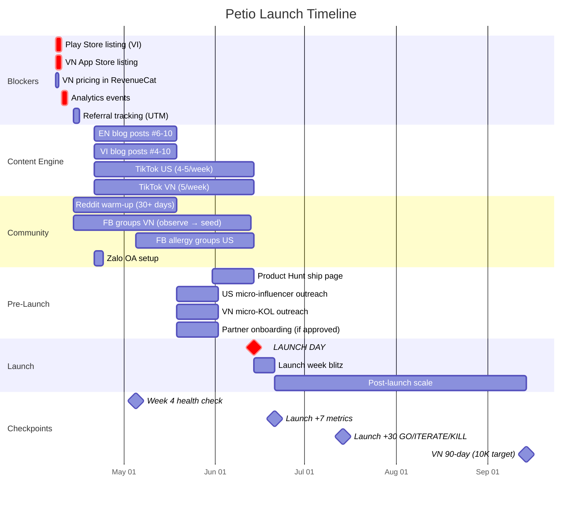
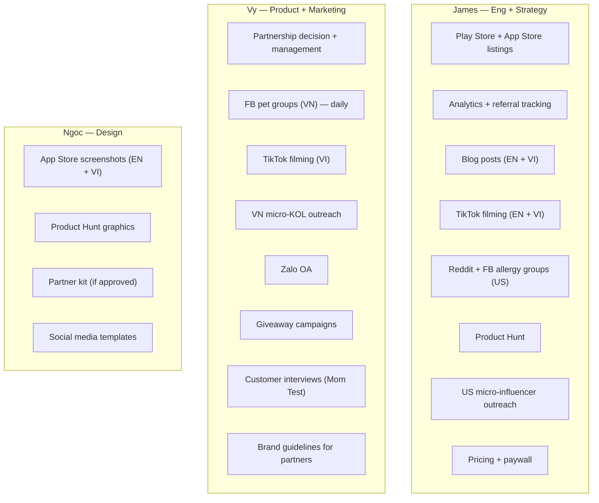

# Petio Growth Funnel & Strategy Map

**Launch:** June 14, 2026 | **Markets:** US (primary) + Vietnam (50/50 split)

---

## The Funnel

---

## Channel Strategy by Market

---

## Growth Loops

---

## Funnel Metrics & Targets

| Stage | Metric | GO | ITERATE | KILL |
|-------|--------|-----|---------|------|
| **Acquisition** | Total installs (Launch +30) | >3,000 | 1,000-3,000 | <1,000 |
| **Activation** | Profile + first scan completion | >60% | 40-60% | <40% |
| **Retention** | D30 retention | >15% | 8-15% | <8% |
| **Revenue** | Free-to-paid conversion | >5% | 2-5% | <2% |
| **Revenue** | Paying users (Launch +30) | >150 | 50-150 | <50 |
| **Referral** | Scan result share rate | >10% | 5-10% | <5% |

### Vietnam-Specific (Launch +90)

| Metric | WIN | COMPETITIVE | LOSING |
|--------|-----|-------------|--------|
| Vietnam installs | >10,000 | 3,000-10,000 | <3,000 |
| TikTok VN followers | >5,000 | 1,000-5,000 | <1,000 |
| Vietnamese blog rankings ("chó ăn được gì") | Top 3 | Page 1 | Not ranking |

---

## Timeline to Launch

---

## Ownership

